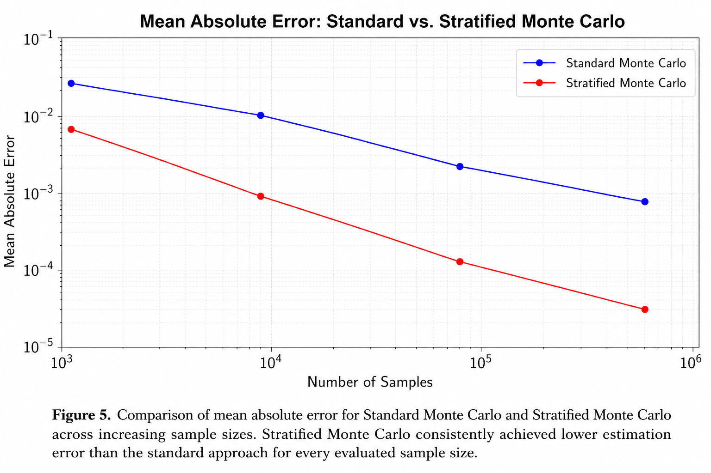

# Empirical Evaluation of Monte Carlo Sampling Strategies for Numerical Integration

An independent undergraduate research project investigating Monte Carlo sampling strategies for numerical integration through reproducible C++ implementations, statistical analysis, and comparative algorithm evaluation.



---

## Research Paper

The complete research paper describing the methodology, mathematical foundations, experimental design, statistical analysis, and findings is available here:

📄 **[Empirical Evaluation of Monte Carlo Sampling Strategies for Numerical Integration (PDF)](paper/Empirical_Evaluation_of_Monte_Carlo_Sampling_Strategies.pdf)**

---

## Overview

Monte Carlo methods are widely used in scientific computing, computational physics, quantitative finance, Bayesian inference, machine learning, and computer graphics to approximate numerical quantities through repeated random sampling.

This project presents an empirical evaluation of **Standard Monte Carlo** and **Stratified Monte Carlo** sampling strategies using the numerical estimation of π as a reproducible benchmark problem. Rather than treating π estimation as the primary objective, the study investigates how sampling strategy influences estimator accuracy, convergence behavior, statistical reliability, variance, and computational performance.

The project extends a traditional classroom implementation into a structured empirical investigation through automated benchmarking, reproducible experimentation, repeated statistical trials, confidence interval analysis, and comparative algorithm evaluation.

---

## Research Objectives

This project investigates the following research questions:

- How does estimation accuracy change as the number of Monte Carlo samples increases?
- How does Stratified Monte Carlo compare with Standard Monte Carlo under identical computational budgets?
- What trade-offs exist between estimation accuracy and computational performance?
- How do repeated statistical trials improve the reliability of experimental conclusions?

---

## Methodology

The experimental framework includes:

- Standard Monte Carlo implementation in C++
- Stratified Monte Carlo implementation
- `std::mt19937` (Mersenne Twister) pseudo-random number generator
- Automated benchmarking across multiple sample sizes
- 100 independent Monte Carlo simulations for every experiment
- Runtime measurement using the C++ `<chrono>` library
- Statistical analysis including:
  - Mean estimated value of π
  - Mean absolute error
  - Sample standard deviation
  - 95% confidence intervals

---

## Experimental Results

Experiments were conducted using sample sizes ranging from **10³** to **10⁷** randomly generated samples.

The evaluation demonstrates that:

- Standard Monte Carlo converges toward the true value of π as sample size increases.
- Stratified Monte Carlo consistently produces lower estimation error than Standard Monte Carlo.
- Variance reduction improves estimator accuracy without requiring proportional increases in computational effort.
- Repeated statistical experimentation provides significantly more reliable conclusions than individual simulation runs.

The repository includes:

- Experimental datasets
- Statistical analysis
- Performance benchmarking
- Reproducible figures
- Complete research paper

---

## Repository Structure

```text
paper/
    Empirical_Evaluation_of_Monte_Carlo_Sampling_Strategies.pdf

src/
    standard_mc.cpp
    stratified_mc.cpp
    stratified_trials.cpp

scripts/
    plot_results.py

figures/
    comparison_error.png
    error_vs_samples.png
    runtime_vs_samples.png
    stddev_vs_samples.png
    ci95_vs_samples.png

data/
    experiment_results.csv
    stratified_results.csv
```

---

## Technologies

- C++20
- Python
- Matplotlib
- GNU g++
- Git
- GitHub

---

## Reproducibility

All experiments were designed to be fully reproducible.

- Random number generator: `std::mt19937`
- Independent trials: **100**
- Random seeds: **42–141**
- Compiler: **GNU g++ (C++20)**
- Operating system: **Windows 11**
- Hardware: **Intel Core i7-13620H, 16 GB RAM**

---

## Building the Project

Compile using:

```bash
g++ -std=c++20 -O2 src/standard_mc.cpp -o standard_mc
```

Run:

```bash
./standard_mc
```

Similar commands may be used for the remaining implementations included in the repository.

---

## Future Work

Potential extensions include:

- Importance Sampling
- Latin Hypercube Sampling
- Quasi-Monte Carlo methods
- OpenMP parallelization
- GPU acceleration
- Higher-dimensional numerical integration
- Additional benchmark integration problems

---

## About the Author

**Aarush Ghag**

B.S. Computer Science  
California State University, Chico

Research interests:

- Scientific Computing
- Numerical Methods
- Algorithms
- Machine Learning

---

## Citation

If you reference or build upon this work, please cite:

> Ghag, A. (2026). *Empirical Evaluation of Monte Carlo Sampling Strategies for Numerical Integration*. Independent Undergraduate Research Project, California State University, Chico.

---

## License

This project is released under the MIT License.
